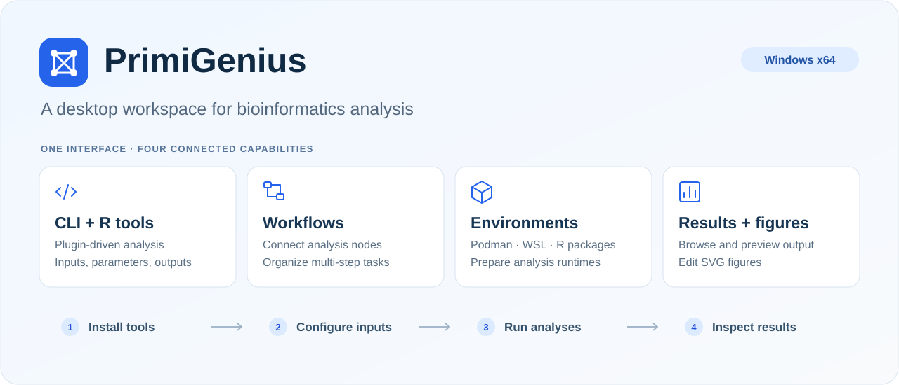
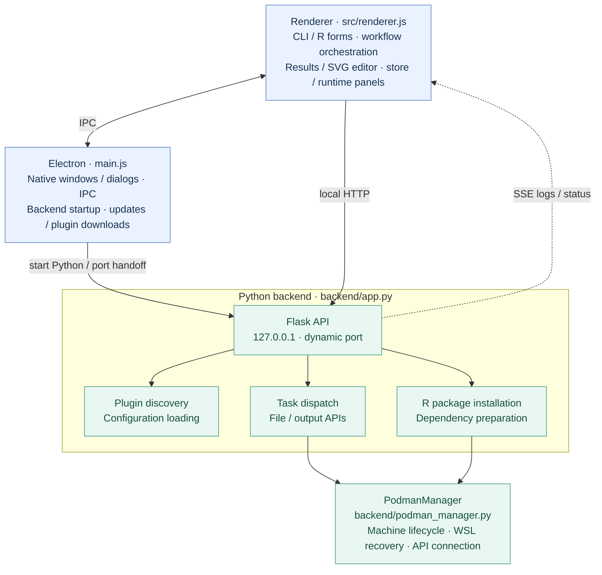
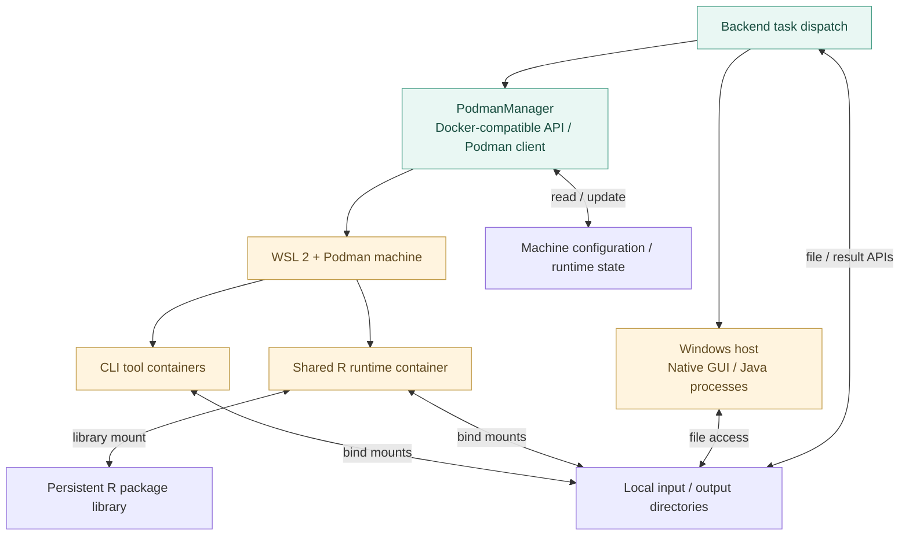
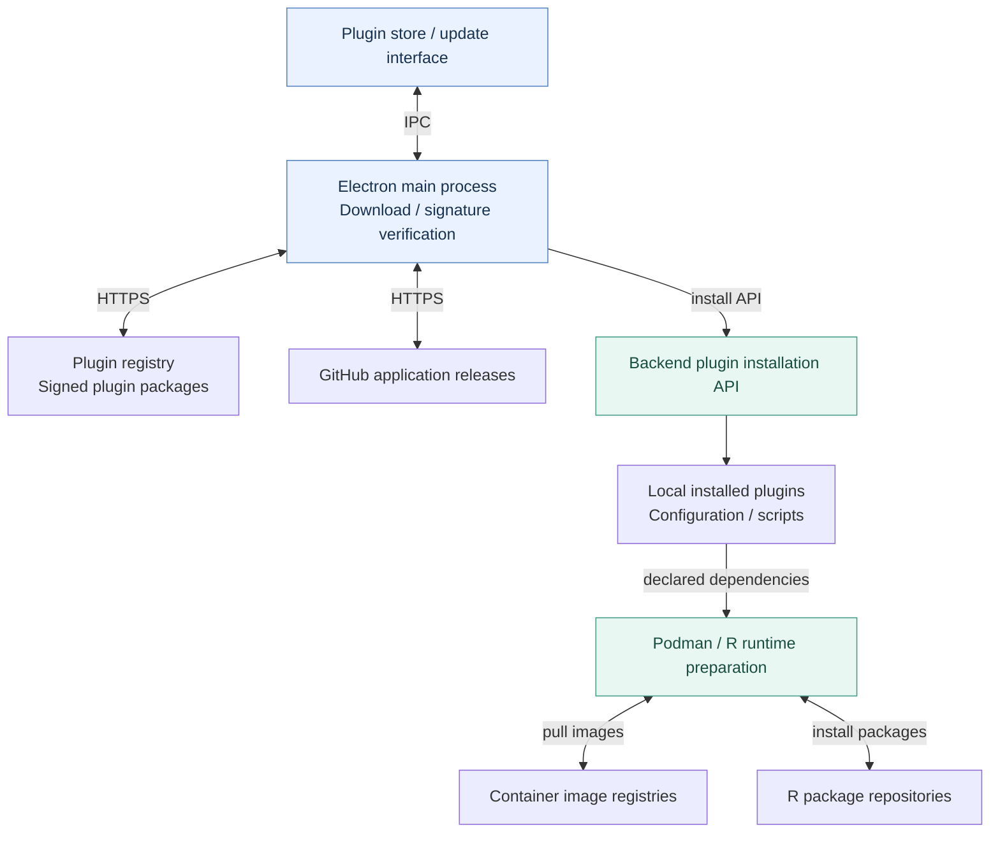

# PrimiGenius

**English** | [简体中文](README.zh-CN.md)

PrimiGenius is a Windows desktop application for bioinformatics. It brings command-line and R tools, workflow construction, container management, and result viewing into one interface. Available analyses depend on the plugins you install.

[Download](https://github.com/jianbai-design/PrimiGenius/releases) · [Report an issue](https://github.com/jianbai-design/PrimiGenius/issues) · [Plugin repository](https://github.com/jianbai-design/PrimiGenius-plugins)



## Features

| Feature | Description |
| --- | --- |
| CLI and R tools | Find installed tools and configure inputs, parameters, and output directories. |
| Workflow Builder | Connect tools into workflows and manage execution. |
| Plugin management | Browse the plugin store or install packages locally. |
| Runtime management | Manage Podman images and machines and prepare R dependencies. |
| Results and editing | Browse output files, preview supported formats, and edit SVG figures. |
| Desktop utilities | Chinese and English interfaces, execution logs, updates, and a built-in browser. |

## Install and use

Download `PrimiGenius-Setup-<version>.exe` from [Releases](https://github.com/jianbai-design/PrimiGenius/releases). The current installer targets **Windows x64**. Run it and follow the setup instructions; enabling WSL 2 and Podman may require administrator approval or a restart.

1. Start PrimiGenius and complete the runtime setup prompted by the application.
2. Install the plugins needed for your analyses.
3. Open a tool under **CLI Tools** or **R Tools**, or connect tools in **Workflow Builder**.
4. Select inputs and an output directory, run the analysis, and inspect logs and results.

Initial downloads of plugins, images, and R packages require network access. Offline availability depends on resources already installed. Analysis files remain in the selected local locations.

## Architecture

### Application processes and communication



### Task execution and local data



### Plugin and runtime distribution



The interface uses Electron IPC for native windows, file dialogs, updates, and plugin downloads, and local HTTP APIs to submit analysis tasks. SSE carries logs and status back to the interface. Workflow orchestration lives in the renderer. The main process starts Python and passes its dynamically assigned port to the interface.

The backend reads plugin configuration, dispatches CLI, R, or native GUI/Java tasks, and provides file and result APIs. PodmanManager manages the WSL/Podman machine and service connections. Containers access input and output directories through bind mounts; R installation and execution use the shared R runtime. Plugins, images, R packages, and application updates come from the external distribution services shown above.

## Run from source

Use Windows x64 with Node.js/npm and Python on `PATH`. This publication was prepared with Node.js 24.14.0 and Python 3.14.3; compatibility with other versions has not been established. Container tasks require WSL 2 and Podman, either installed on the system or supplied under `podman/`.

```powershell
git clone https://github.com/jianbai-design/PrimiGenius.git
cd PrimiGenius
python -m venv .venv
.\.venv\Scripts\Activate.ps1
python -m pip install -r backend/requirements.txt
npm ci
npm start
```

The development launcher uses `python` from the active environment. The direct Python dependencies are pinned; transitive dependencies are not fully locked. The optional native Podman Python client is not required for the Docker SDK connection path. No analysis plugins are included in this checkout.

## Build a Windows installer

The build uses PyInstaller and electron-builder/NSIS. The current packaging configuration also requires external resources that are not stored in this source repository:

| Path | Resource |
| --- | --- |
| `podman/podman.exe`, `podman/win-sshproxy.exe` | Windows binaries from [Podman releases](https://github.com/containers/podman/releases). |
| `build/wsl.2.7.3.0.x64.msi` | Matching x64 MSI from [WSL releases](https://github.com/microsoft/WSL/releases). |
| `build/jre8.zip` | A redistributable Java 8 runtime archive compatible with the application's Java runtime layout. |

Supply these resources and review their individual redistribution terms before packaging. The source checkout alone is insufficient to reproduce the bundled installer. The icon and NSIS hook are included; the build wrapper downloads or reuses electron-builder's `winCodeSign` tooling.

```powershell
npm ci
python -m pip install -r backend/requirements-build.txt
cd backend
python -m PyInstaller app.spec --noconfirm
cd ..
npm run dist
```

The output is written to `dist_output/`. Alternatively, `build_installer.bat` runs the build sequence; it deletes old build output and stops processes that may hold files open. Save your work before using it. Packaging and first-run analysis require separate verification.

`backend/init_podman.py` is a maintenance helper that forcibly removes a Podman machine. It is **not a normal setup command**; do not run it against an environment whose data you need to retain.

## Source layout and checks

```text
main.js                 Electron main process and desktop integration
src/                    Interface, styles, and bundled frontend assets
backend/                Python API, Podman management, and dependency lists
backend/tests/          Backend regression checks
build/                  Installer hook, build wrapper, and application icon
.docker/                R runtime image recipe
docs/images/            README illustration
```

```powershell
node --check main.js
node --check src/renderer.js
python -B -m unittest discover -s backend/tests -p "test_*.py"
```

These checks cover selected backend contracts and syntax. They do not replace Windows GUI, WSL/container, or installer testing.

## License and scope

The main application is distributed under [GNU GPL v3.0](LICENSE). Third-party assets retain their own licenses; Font Awesome's terms are included in [its license file](src/vendor/fontawesome/LICENSE.txt).

Plugin source and packages, registries, container images, third-party runtime binaries, signing keys, and user data are outside this source publication. Plugins are maintained in the [separate plugin repository](https://github.com/jianbai-design/PrimiGenius-plugins) under their applicable terms. Old plugin packages were removed from the current repository tree; earlier commits remain in Git history.
