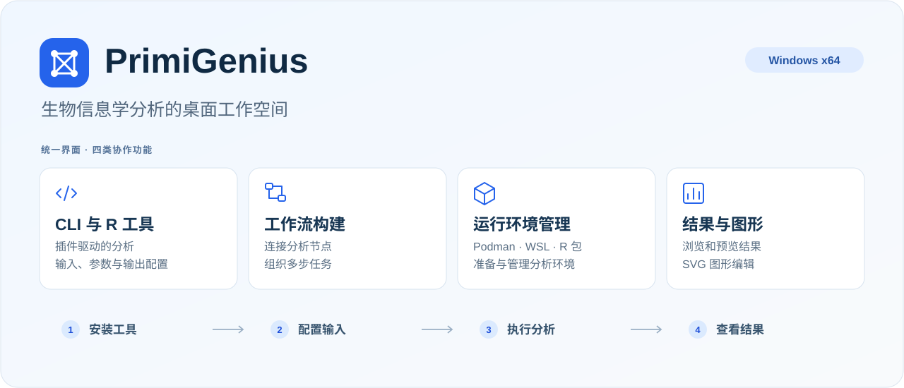
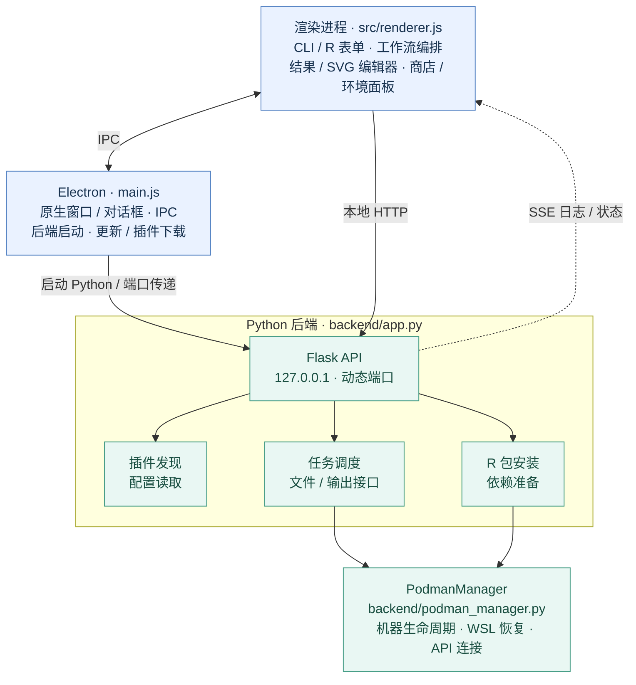
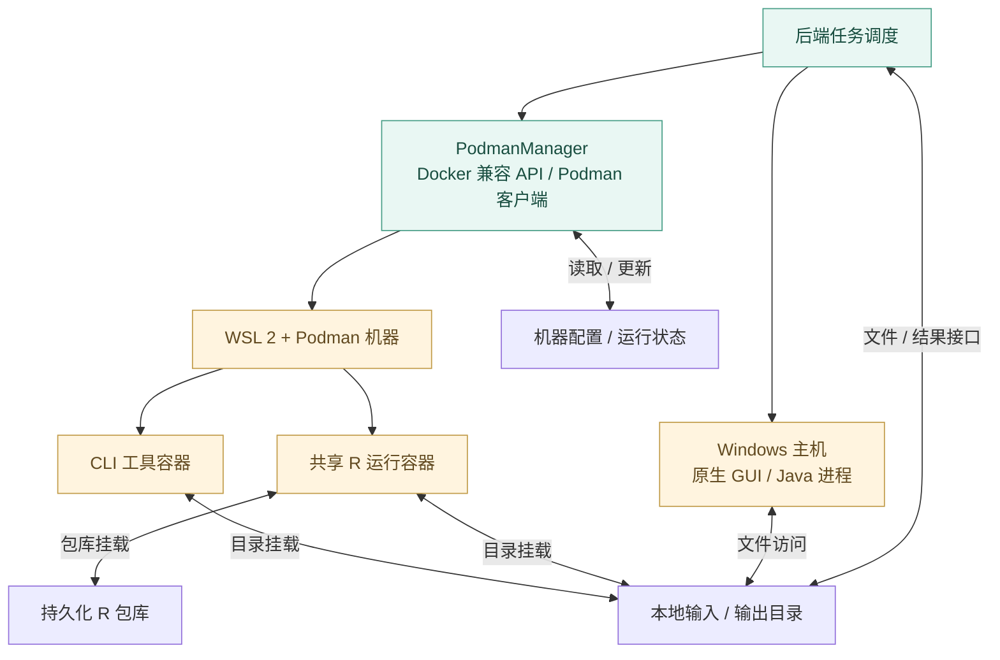
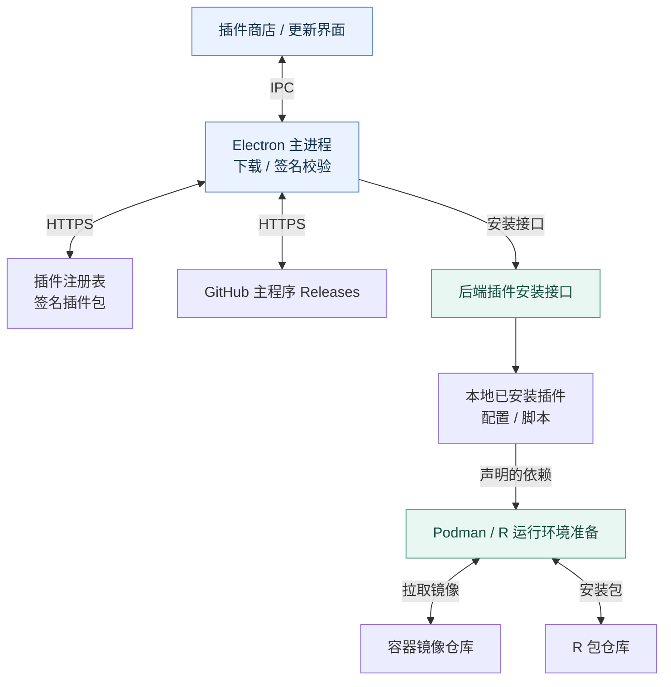

# PrimiGenius

[English](README.md) | **简体中文**

PrimiGenius 是面向生物信息学分析的 Windows 桌面程序，将命令行工具、R 工具、工作流构建、容器管理和结果查看集中在同一界面中。可用分析功能取决于用户安装的插件。

[下载安装包](https://github.com/jianbai-design/PrimiGenius/releases) · [反馈问题](https://github.com/jianbai-design/PrimiGenius/issues) · [插件仓库](https://github.com/jianbai-design/PrimiGenius-plugins)



## 功能

| 功能 | 说明 |
| --- | --- |
| CLI 与 R 工具 | 查找已安装工具，配置输入文件、参数和输出目录。 |
| Workflow Builder | 将工具连接成工作流并管理执行过程。 |
| 插件管理 | 浏览插件商店或安装本地插件包。 |
| 运行环境管理 | 管理 Podman 镜像和机器，准备 R 包依赖。 |
| 结果查看与编辑 | 浏览输出文件，预览支持的格式，编辑 SVG 图形。 |
| 桌面辅助功能 | 中英文界面、执行日志、主程序更新和内置浏览器。 |

## 安装与使用

从 [Releases](https://github.com/jianbai-design/PrimiGenius/releases) 下载 `PrimiGenius-Setup-<版本>.exe`。当前安装包面向 **Windows x64**。运行并按提示安装；启用 WSL 2 和 Podman 时，可能需要管理员授权或重启。

1. 启动 PrimiGenius，按应用提示完成运行环境准备。
2. 安装分析所需的插件。
3. 在 **CLI Tools**、**R Tools** 中打开工具，或在 **Workflow Builder** 中连接工具。
4. 选择输入与输出目录，运行分析并查看日志和结果。

首次下载插件、镜像和 R 包需要联网；能否离线运行取决于本机已准备的资源。分析文件保存在所选的本地位置。

## 应用结构

### 应用进程与通信



### 任务执行与本地数据



### 插件与运行环境分发



界面通过 Electron IPC 调用原生窗口、文件对话框、更新和插件下载功能，通过本机 HTTP API 提交分析任务；SSE 将日志和状态返回界面。工作流编排位于渲染进程。主进程负责启动 Python 后端并将动态端口传给界面。

后端读取插件配置，分派 CLI、R 或原生 GUI/Java 任务，并提供文件与结果接口。PodmanManager 管理 WSL/Podman 机器和服务连接；容器通过目录挂载访问输入和输出。R 包安装与运行使用共享的 R 运行环境。插件、镜像、R 包和主程序更新来自图中对应的外部分发服务。

## 从源码运行

使用 Windows x64，并确保 Node.js/npm 和 Python 位于 `PATH` 中。本次发布整理环境为 Node.js 24.14.0 和 Python 3.14.3，其他版本的兼容性尚未确认。容器任务需要 WSL 2 和 Podman；应用可使用系统安装的 Podman，也可使用 `podman/` 下的二进制文件。

```powershell
git clone https://github.com/jianbai-design/PrimiGenius.git
cd PrimiGenius
python -m venv .venv
.\.venv\Scripts\Activate.ps1
python -m pip install -r backend/requirements.txt
npm ci
npm start
```

开发模式使用当前环境中的 `python`。依赖清单固定了直接 Python 依赖版本，尚未完整锁定传递依赖。Docker SDK 连接路径不要求安装可选的原生 Podman Python 客户端。本源码仓库不附带分析插件。

## 构建 Windows 安装包

构建使用 PyInstaller 和 electron-builder/NSIS。当前打包配置还要求以下外部资源，它们不保存在源码仓库中：

| 路径 | 资源 |
| --- | --- |
| `podman/podman.exe`、`podman/win-sshproxy.exe` | 来自 [Podman Releases](https://github.com/containers/podman/releases) 的 Windows 二进制文件。 |
| `build/wsl.2.7.3.0.x64.msi` | 来自 [WSL Releases](https://github.com/microsoft/WSL/releases) 的对应 x64 MSI。 |
| `build/jre8.zip` | 可再分发、并符合应用 Java 运行目录结构的 Java 8 运行时压缩包。 |

打包前需要准备这些资源，并分别核对再分发条件。仅克隆源码还不足以复现包含运行资源的安装包。仓库已提供图标和 NSIS 安装脚本；构建包装脚本会下载或复用 electron-builder 的 `winCodeSign` 工具。

```powershell
npm ci
python -m pip install -r backend/requirements-build.txt
cd backend
python -m PyInstaller app.spec --noconfirm
cd ..
npm run dist
```

安装包输出到 `dist_output/`。也可使用 `build_installer.bat`；它会删除旧构建产物，并终止可能占用文件的进程，执行前请保存工作。打包与首次启动分析需要分别验证。

`backend/init_podman.py` 是会强制删除 Podman 机器的维护脚本，**不是常规安装步骤**；需要保留环境数据时不要运行它。

## 源码目录与检查

```text
main.js                 Electron 主进程与桌面集成
src/                    界面、样式及本地前端资源
backend/                Python API、Podman 管理和依赖清单
backend/tests/          后端回归检查
build/                  安装脚本、构建包装脚本和应用图标
.docker/                R 运行镜像构建配方
docs/images/            README 配图
```

```powershell
node --check main.js
node --check src/renderer.js
python -B -m unittest discover -s backend/tests -p "test_*.py"
```

这些检查覆盖部分后端约定和语法，不能替代 Windows 界面、WSL/容器和安装包测试。

## 许可证与公开范围

主程序依据 [GNU GPL v3.0](LICENSE) 分发。第三方资源保留各自许可证，Font Awesome 的许可文本位于[此文件](src/vendor/fontawesome/LICENSE.txt)。

插件源码及插件包、注册表、容器镜像、第三方运行时二进制、签名密钥和用户数据不属于本次源码公开范围。插件在[独立插件仓库](https://github.com/jianbai-design/PrimiGenius-plugins)维护，遵循各自适用的条款。旧插件包已从当前目录树中移除，早期提交仍保留在 Git 历史中。
